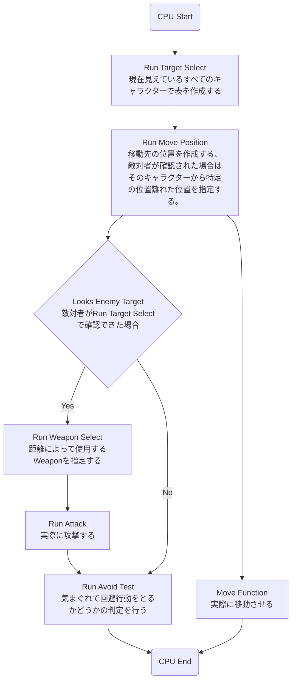

```mermaid
graph TD;

    Start(CPU Start) --> RunTargetSelect[Run Target Select<br>現在見えているすべてのキャラクターで表を作成する];
    RunTargetSelect --> RunMovePosition[Run Move Position<br>移動先の位置を作成する、敵対者が確認された場合はそのキャラクターから特定の位置離れた位置を指定する。];
    RunMovePosition --> MoveFunction[Move Function<br>実際に移動させる];
    RunMovePosition --> LooksEnemyTarget{Looks Enemy Target<br>敵対者がRun Target Selectで確認できた場合};
    LooksEnemyTarget -- Yes --> RunWeaponSelect[Run Weapon Select<br>距離によって使用するWeaponを指定する];
    RunWeaponSelect --> RunAttack[Run Attack<br>実際に攻撃する]
    RunAttack --> RunAvoidTest[Run Avoid Test<br>気まぐれで回避行動をとるかどうかの判定を行う];
    LooksEnemyTarget -- No --> RunAvoidTest
    RunAvoidTest --> End(CPU End);
    MoveFunction --> End;

```