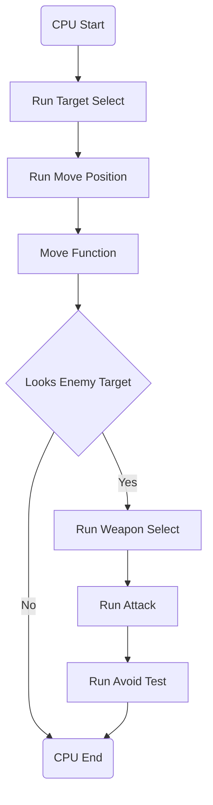

CPUの挙動に関する資料

### Run Target Select
現在見えているすべてのキャラクターで表を作成する

### Run Move Position
移動先の位置を作成する、敵対者が確認された場合はそのキャラクターから特定の位置離れた位置を指定する。

### Move Function
実際に移動させる

### Looks Enemy Target
敵対者がRun Target Selectで確認できたかどうかの判定

### Run Weapon Select
使用するWeaponを選択する

### Run Attack
実際に攻撃する

### Run Avoid Test
回避行動をとるかどうかの判定を行う

